# ADE

The Advanced Discovery Engine (ADE) is an in-house workflow engine that provides a unified execution environment for various projects at Netrias. Projects are broken down into a set of components, where those components pass data to each other to form a workflow. Each component is isolated and configurable, meaning that re-use in future projects (or alternate versions of the same project) is straight-forward.

Why use ADE over other workflow engines? ADE provides several distinct advantages:

 * Highly robust data parsing infrastructure.
 * Streamlined container image creation and execution.
 * Assistive / predictive technology for building workflows.
 * Global data cache.
 * Execution logging.
 * Triggers, scheduling, and reporting.

The following subsections provide an overview of basic ADE usage via ADE's user interface. Be aware that ADE is **pre-alpha software**: While the backend is stable, the user interface has some bugs (none are blockers).

## Table of Contents

- [ADE](#ade)
  * [Table of Contents](#table-of-contents)
  * [Install Instructions](#install-instructions)
  * [Launch Instructions](#launch-instructions)
  * [Graph Manipulation](#graph-manipulation)
    + [Add Node](#add-node)
    + [Remove Node](#remove-node)
    + [Configure Node](#configure-node)
    + [Connect Nodes](#connect-nodes)
    + [Disconnect Nodes](#disconnect-nodes)
    + [View Data](#view-data)
    + [Export Data](#export-data)
    + [Load/Save](#load-save)
  * [Property Manipulation](#property-manipulation)
    + [Dynamic Properties](#dynamic-properties)
    + [Property Actions](#property-actions)
    + [Property Documentation](#property-documentation)
  * [Containerization](#containerization)
  * [Hotkey Reference](#hotkey-reference)

## Install Instructions

The following instructions are for OS X.

1. Ensure the following prerequisites are installed:
   * Java 13 (later versions may work as well)
   * Docker
1. Unpack the supplied ADE archive into a directory of your choosing.
1. Unpack the supplied image archive into `~/.ade_image_repo`.
1. Ensure `java` executable is accessible via `PATH` environment variable.

## Launch Instructions

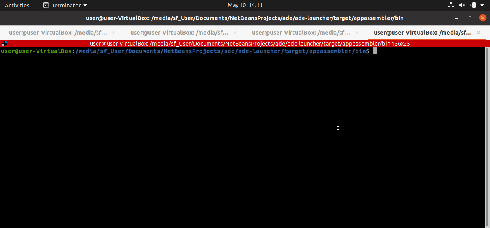

The following instructions are for OS X.

Prior to launching, ensure `java` executable is accessible via `PATH` environment variable.

Navigate to the ADE directory and run `./bin/launcher.sh` to launch. Once launched, a browser tab should automatically open and point to [http://localhost:8886](http://localhost:8886).

The browser tab becomes ready to use once a small block of text appears in the upper-right corner. Currently, a bug is present that may cause a delay of ~10s or so before the UI becomes usable.

## Graph Manipulation

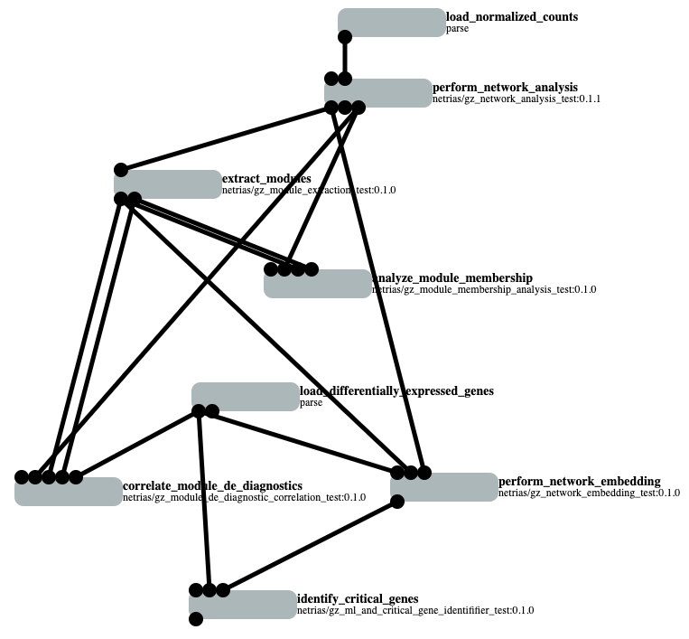

Workflows are represented as directed acyclic graphs:

 * Nodes represent tasks that transform a set of tables.
 * Edges represent tables flowing between nodes.

Each node has a set of configuration properties that define how many inputs / outputs it has as well as how it transforms data. In the above example, the node `perform_network_embedding` (located near bottom-right) performs the network embedding task in an ASSIST workflow.

Node inputs are outputs are represented as connectors. Connectors span across the top and bottom of each node:

 * Top connectors are for input data (tables).
 * Bottom connectors are for output data (tables).

In the above example, the node `perform_network_embedding` (located near bottom-right) reads in 3 input tables and writes out 1 output table.

Colors represent the execution state of each node:

| Color      | Description                  |
|------------|------------------------------|
| 🟩 (green) | Node is actively executing.  |
| ⬜ (gray)  | Node executed successfully.  |
| 🟥 (red)   | Node executed with error.    |
| ⬛ (black) | Node is in an unknown state. |

In the above example, all nodes are gray, meaning that all nodes in the graph executed successfully.

Graph manipulation instructions are detailed in the sub-sections below. ADE automatically executes the graph as the user manipulates it. Caching is used to ensure that an execution only executes changed nodes and their children, not the entire graph.

### Add Node

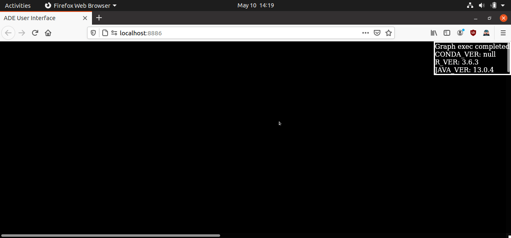

Press `N` to show the node selection textbox. Type in the node type and press `<ENTER>`.

The new node should appear at the mouse coordinates when `N` was originally pressed. Click-and-drag the node to change its position.

To cancel, press `<ESC>`.

### Remove Node

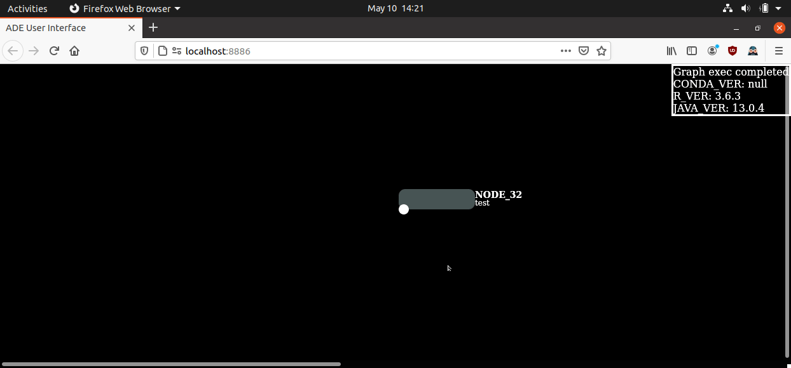

Hover over node and press `D`.

### Configure Node

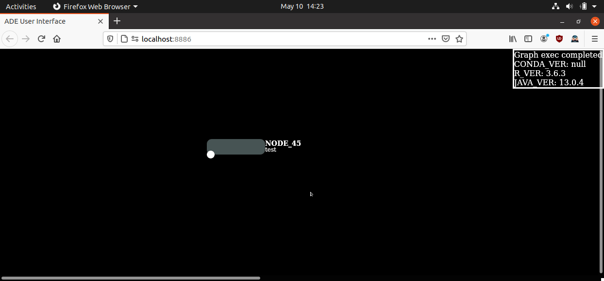

Hover over node and press `V`. The tab that opens is horizontally split into 2 panes:

 * Top pane contains the node's configuration properties.
 * Bottom pane contains a preview of the node's input and output data.

As node configurations change, the graph re-executes. Cached executions are used where appropriate to speed up executions.

Invalid configuration inputs automatically revert.

Currently, a user interface bug causes configuration changes made in rapid succession to snap back.

### Connect Nodes

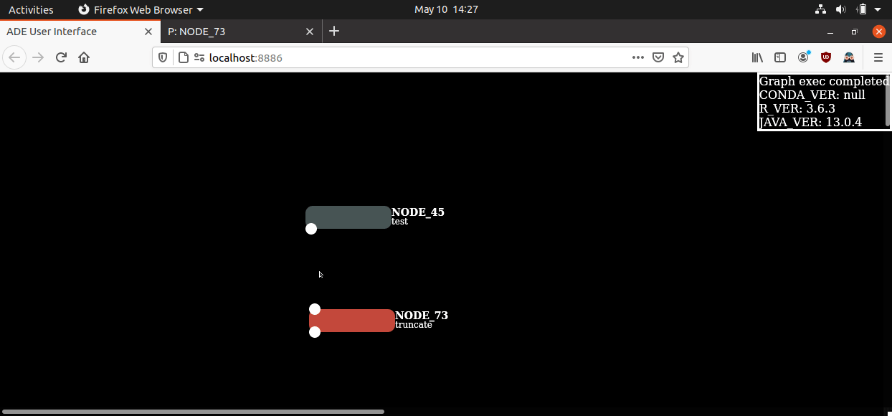

Nodes have connectors (black dots) spanning across their top and bottom:

 * Top connectors are for input tables.
 * Bottom connectors are for output tables.

Hover over a connector and click-and-drag to another connector of opposing type (e.g. input connector to output connector). Connections forming cycles are rejected.

Note that hovering over a connector will pop-up a tooltip displaying the ID of that connector as well as the column names for the table at that connector.

### Disconnect Nodes

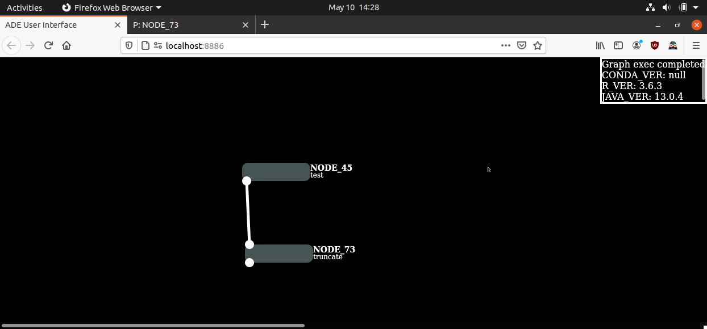

Hover over connection and press `D`.

### View Data

Hover over connector and press `V`. The tab that opens is visually truncated to to 1000 rows by 25 columns (full data is preserved internally).

On graph re-execution, this tab automatically updates.

### Export Data

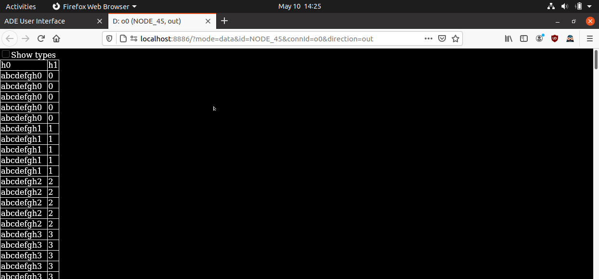

Hover over connector and press `V`. In the tab that opens, press `E`. Type in the path of the CSV file to save and press `Enter`. 

Although the data displayed on this tab is visually truncated, the full data is exported to the CSV.

To cancel, press `<ESC>`.

### Load/Save

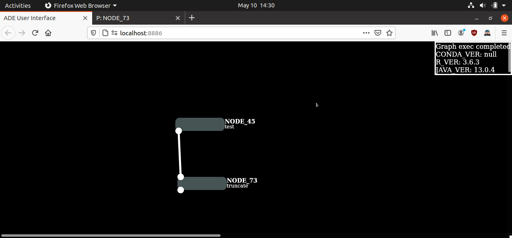

Press `P`. Type in the path of the YAML file to save and either click `Load` or `Save`. Any subsequent changes to the workflow will automatically persist to that workflow file.

To cancel, click `Cancel`.

To reset the workflow, click `New Graph`

## Property Manipulation

Nodes are configurable via their properties, accessible through ADE's property view ([access instructions](#configure-node)). 

Properties are displayed as a hierarchy tree, where each property in the tree is exposed as one of several UI elements:

| Type         | Description                                                          |
|--------------|----------------------------------------------------------------------|
| Text         | Single-line or multi-line string.                                    |
| Number       | 64-bit integer or float.                                             |
| Boolean      | True or false.                                                       |
| Selection    | Single choice out of several preset values.                         |
| Combinations | List, set, or map that groups together other properties as children. |

In addition, properties may be modified directly in a YAML, displayed at the very end of the tree.

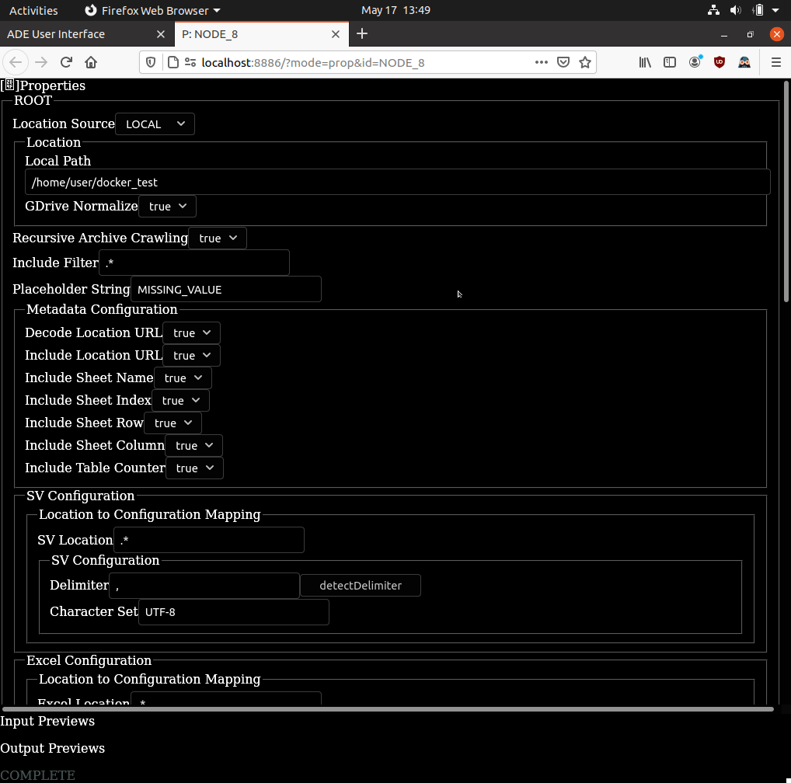

### Dynamic Properties

A property may have internal logic that causes any of the following behaviours on modification:

 1. A modified value may get reverted.
    * Example: Certain properties may not be negative (e.g. a calendar year can't be negative).
    * Example: Certain properties are length constrained (e.g. a CSV delimiter char must contain exactly 1 char).
    * Example: Certain properties must match some pattern (e.g. an e-mail can't be missing @).
 2. A modified value may get modified.
    * Example: Certain properties may have whitespace trimmed on input (e.g. whitespace at end of e-mail address).  
    * Example: Certain properties may require different encoding (e.g. URL unsafe characters).
 3. A modified value may cause the disappearance, introduction, and modification of other properties.
    * Example: Certain properties may require an entirely different set of surrounding properties based on their value (e.g. a linear regression model requires different tuning parameters than a deep learning model).

### Property Actions

A property may have actions associated with it. These actions are exposed as buttons next to that property's UI element, and when clicked perform high-level tasks that modify that property and potentially other surrounding properties. For example, a property that represents which CSV delimiter to use may have an action that scans through an entire directory of CSVs to determine what the CSV delimiter should be.

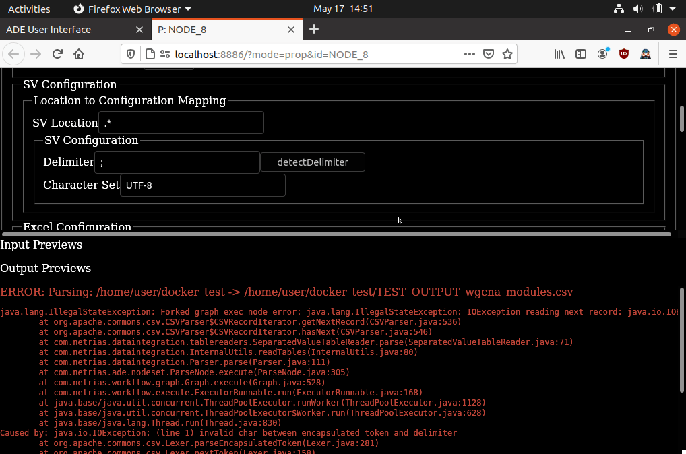

### Property Documentation

A property may have short-hand documentation associated with it. The documentation is visible as a tooltip when hovering over a property's label.

Be aware that only internal ADE nodes expose documentation. There is no documentation support for [containerized nodes](#containerization) at the moment.

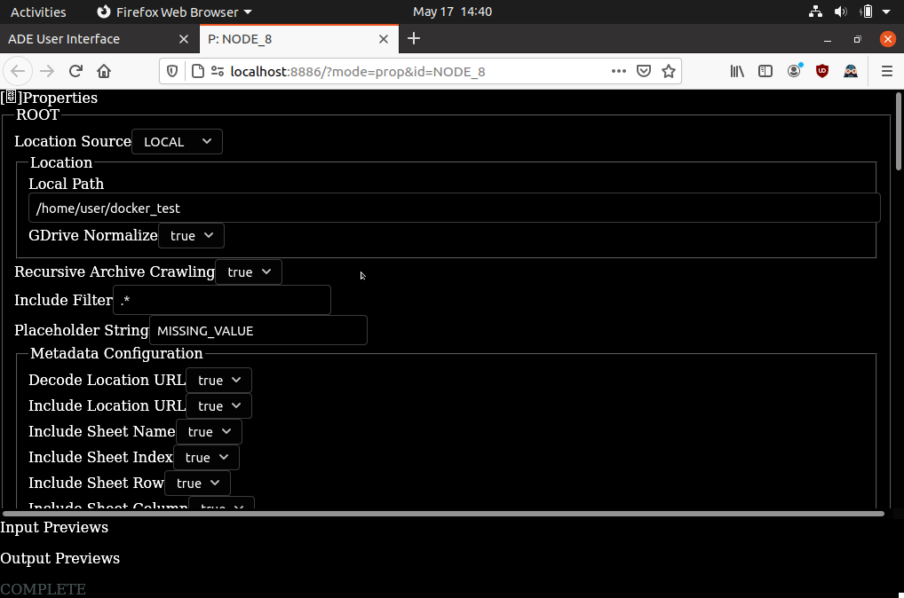

## Containerization

Container images that follow a set of ADE conventions may be wrapped as ADE nodes. Containerization provides the benefit of workflow reproducibility:

 * Reduction in workflow breakage across environments.
 * Increase in reproducible outputs across environments.

Containerized ADE nodes may expose special properties that control resources:

 * `docker_mem` controls the amount of memory (in bytes).
 * `docker_cpu` controls the amount of CPU (in cores).
 * `docker_volume` prefix controls volume mappings (host to container, `:` delimiter).

These special properties are not required to exist. If omitted, volume mappings are not possible / resource allocations are set directly by Docker's runtime.

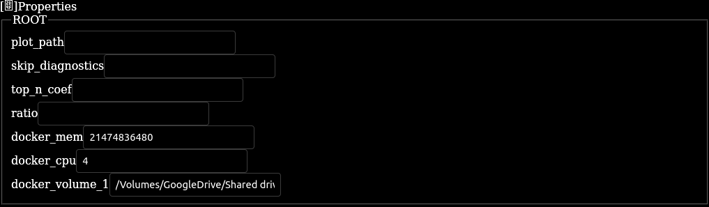

Streamlined creation of ADE-complaint images is possible through ADE's container creation tool. In most cases, this tool is simple enough that most non-technical users (e.g. scientists) are able to directly create images without supervision.

Note that ADE-complaint container images __are not__ locked-in to ADE. Each container image comes with a command-line interface that operates in a similar fashion as its node counterpart:

 * Input tables are passed in through command-line arguments.
 * Output tables are passed in through command-line arguments.
 * Properties are passed in through command-line arguments.
 * Resource allocations are set manually by the user on the Docker runtime (volume mappings, mem, cpu).

If not enough command-line arguments are supplied by the user, the container outputs the required signature vs the supplied arguments.

## Hotkey Reference

Graph view hotkeys:

**NOTE:** A hotkey may perform different functions depending on what graph element the mouse is hovering on.

| Key       | Context    | Description              |
|-----------|------------|--------------------------|
| `N`       | Graph      | Add node                 |
| `R`       | Node       | Replicate node           |
| `D`       | Node       | Delete node              |
| `D`       | Connection | Delete connection        |
| `.`       | Node       | Toggle inspection mode   |
| `Shift-N` | Node       | Rename node              |
| `V`       | Node       | Open properties          |
| `V`       | Connector  | View data                |
| `Q`       | Connector  | Calculate summary stats (press Q on two connectors and it will compare, Q twice on the same connector will summarize that table) |
| `Shift-Z` | Connector  | Quick line plot          |
| `Shift-X` | Connector  | Quick histogram          |
| `Shift-C` | Connector  | Quick heatmap            |
| `P`       | Graph      | Load or save             |
| `E`       | Graph      | Show environment vars    |
| `C`       | Graph      | Clear cache              |

Property view hotkeys:

| Key                           | Description                    |
|-------------------------------|--------------------------------|
| `ALT-0`                       | Scroll to top                  |
| `ALT-1` to `ALT-9`            | Scroll to corresponding output |
| `CTRL-ALT-1` to `CTRL-ALT+-9` | Scroll to corresponding input  |

Data view hotkeys:

| Key                           | Description                    |
|-------------------------------|--------------------------------|
| `E`                           | Export data as CSV             |